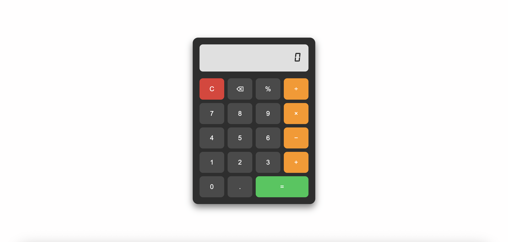

# Web Calculator

Jednoduchá webová kalkulačka s retro displejom, vyrobená pomocou **HTML**, **CSS** a **JavaScriptu**.  
A simple web calculator with a retro display, built using **HTML**, **CSS**, and **JavaScript**.

---

## Funkcie / Features

- ✅ Základné operácie: sčítanie, odčítanie, násobenie, delenie  
  ✅ Basic operations: addition, subtraction, multiplication, division

- ✅ Podpora percent (%)  
  ✅ Percentage calculation support

- ✅ Klávesnicové ovládanie (číselník, Enter, Backspace, Escape)  
  ✅ Keyboard control (numbers, Enter, Backspace, Escape)

- ✅ Retro displej so špeciálnym digitálnym fontom  
  ✅ Retro-style display with custom digital font

- ✅ Responzívny dizajn  
  ✅ Responsive design (mobile-friendly)

---

## Technológie / Technologies

- HTML5
- CSS3 (Grid, Flexbox, vlastný font)
- JavaScript (DOM, eventy, eval)

---

## Spustenie projektu / Run the project

Otvorte `index.html` v prehliadači alebo použite Live Server vo VS Code.  
Open `index.html` in a browser or use Live Server in VS Code.

---

## 📂 Štruktúra / Structure

WebCalculator/
├── index.html
├── style.css
├── script.js
├── fonts/
│ └── digital-7.italic.ttf
└── images/sc

---

## Licencia / License

Projekt je určený na študijné a portfóliové účely.  
This project is free to use and modify for educational/portfolio purposes.